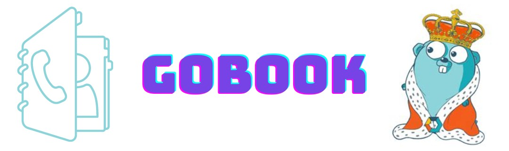

# Gonebook the phonebook

## Description

- My motivation for creating this phonebook was to develop my skills with the GO syntax and to learn more about database integration. 
- This phonebook simplifies database integration by providing quick and concise responses, facilitating the retrieval of such data.
- This project enhanced my Go skills, providing hands-on experience in database integration, Docker usage, and general database management.

## Instalation
### Requirements
  - Docker
  - Git
  - GO version used -> 1.21.6

```
  // Cloning this repo
  git clone git@github.com:odmrs/crud-phonebook.git
  cd crud-phonebook

  // Up the docker postegre image
  sudo docker compose up

  // Run the gobook
  go run main.go
```
## Usage #TODO

## Credits
- [GODOCS](https://golangdocs.com/golang-postgresql-example)
